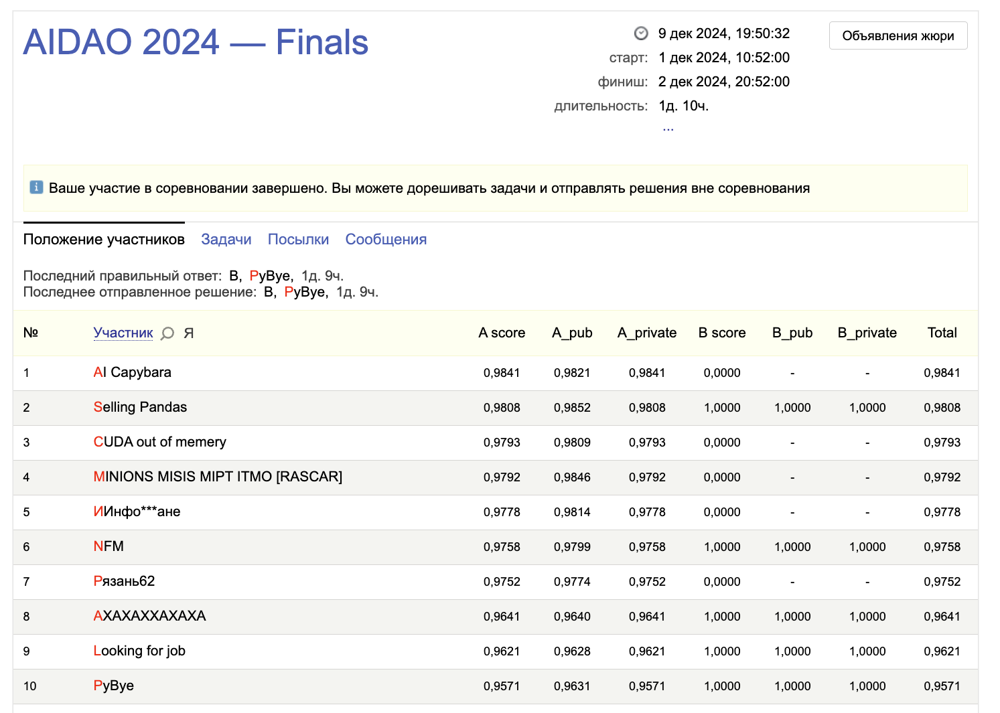

# [AIDAO](https://education.yandex.ru/aidao) — Artificial intelligence and data analysis Olympiad
## 3/40 place solution (40 teams selected from ~400 teams in the qualifying stage https://github.com/RomanMalov/AIDAO-solution )

### Key ideas:
- One backbone (mobile_net)
- Separated heads for damage, fraud, side classes
- Target is the percentage of the human classifiers agreed on the label
- CrossEntropy loss for each head
- Logistic regression on the outputs of the model for 4 pictures
- Polynomial features augmentation on the logreg input

